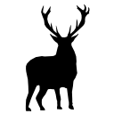

tidytabs
========

I like to keep about 10 different windows opened, each roughly corresponding to a specific topic. Sometimes I will be browsing in the window of topic A and I want to open a link that creates a new tab in the window of topic B.

tidytabs adds a contextual menu to any link, for you to choose which of the existing windows should be used to create the new tab.

Each window is identified by the title of its first tab, or the title of the window itself if it has no tabs.

That's it.

## Install
 
Drag and drop tidytabs.crx on your extensions page in Chrome (Options > Tools > Extensions).

